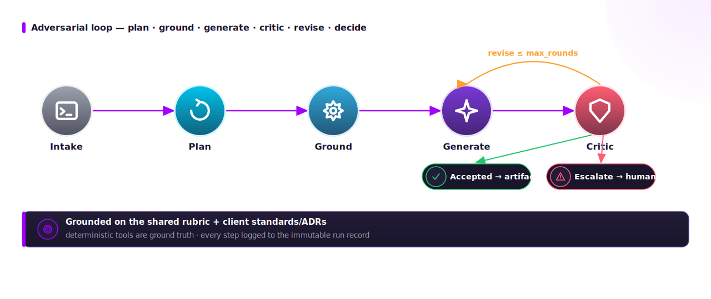

# ADRA documentation

**ADRA — Adversarial Dev Review Agent** — a small, reference orchestrator that
formalizes six engineering capabilities under an adversarial-validation spine:

`code_review` · `pr_eval` · `experiment` · `improve` · `document` · `decide`

> Design intent: encode *what we already do under adversarial human direction* as a
> repeatable, tool-grounded, auditable agent. The substance lives in **deterministic
> tools** + a **shared rubric**; the LLM is the semantic layer on top, so the whole
> system runs offline with no API key.

## Read in this order

| Doc | Contents |
|---|---|
| [architecture.md](architecture.md) | The loop, module interrelations, data flow, a run sequence |
| [design.md](design.md) | Domain model, design decisions, extension points |
| [capabilities.md](capabilities.md) | The six skills in depth (input → grounding → output) |
| [governance.md](governance.md) | The shared rubric, the client standards suite, provenance & history |
| [operations.md](operations.md) | Run it (offline / real), config, CLIs, retarget a client |
| [../refs/README.md](../refs/README.md) | Annotated bibliography (corporate library + external) |

## One-screen architecture

The critic is **mandatory and blocking**: an artifact is accepted only when the
critic is clean; otherwise it revises up to `max_rounds` and then **escalates to a
human** — it never silently approves.
