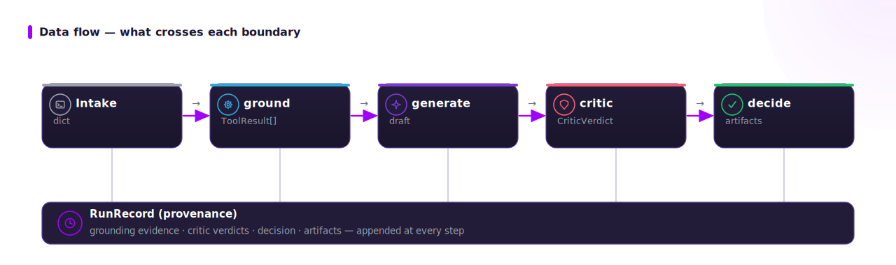
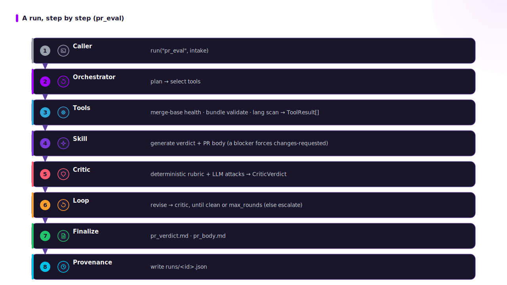

# Architecture

ADRA is a small, explicit state machine (not a heavy framework) with three layered
ideas: **deterministic-first grounding**, an **adversarial generate→critic→revise
loop**, and an **immutable provenance record**. The LLM is reached through a tiny
ADRA-owned `ChatModel` seam (`adra/llm.py`) — no agent framework; the loop is plain,
readable Python whose node contracts stay stable if it is ever wrapped.

## 1. The orchestrated loop

- `plan` / `generate` / `revise` call the model; **`ground` is LLM-free**.
- `criticize` runs the deterministic red-team pass first (the hard floor), then an
  LLM pass for the semantic criteria — both driven by the **same rubric**.
- Decision is one of `accepted` | `escalate`; the loop is bounded by `max_rounds`.

## 2. Module interrelations

Everything flows through one typed contract (`state.py`): tools and skills return
`ToolResult` / `Finding`; the critic returns a `CriticVerdict`; the orchestrator
threads a `RunState` and writes a `RunRecord`.

## 3. Data flow (what crosses each boundary)

The deterministic tools produce **both** the grounding the model may not contradict
**and** the evidence persisted to the run record (the "second-method proof").

## 4. A run, step by step (pr_eval)

## 5. Why deterministic-first

Best-in-class code review combines deterministic static analysis (high precision)
with an LLM for semantic findings; ungrounded self-refinement games its own reward
(`refs`: Reflexion, *Spontaneous Reward Hacking*, *Why LMs Hallucinate*). ADRA puts
the deterministic floor first so the verdict has a hard, evidence-backed base, and
the model only adds what tools cannot settle. That floor is also what lets the whole
loop — and the test suite — run offline with the deterministic mock provider.
