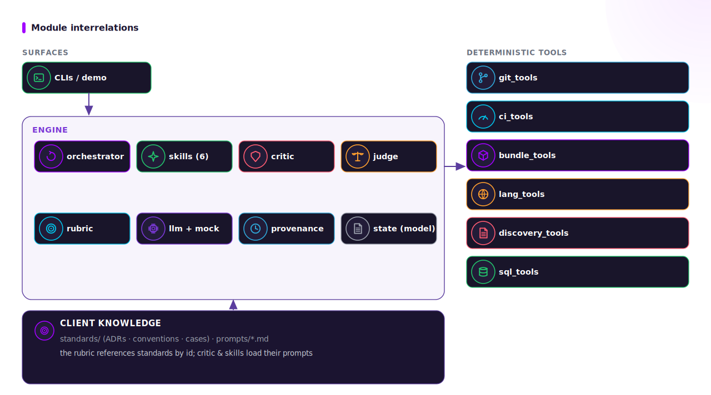
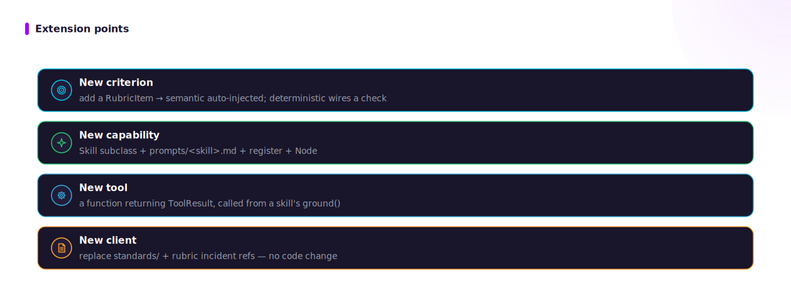

# 02 · The layered design & module map

ADRA has three layers stacked so that the lowest one always carries the verdict.

Read order: 01 → **02** → 03. Landing: [architecture.md](./architecture.md).

## The three layers

| Layer | Modules | Property it guarantees |
|---|---|---|
| **1. Deterministic floor** | `adra/tools/*`, `critic.deterministic_attacks` | Tools are ground truth. A blocking finding raised here stands regardless of the model. Runs with no API key. |
| **2. Adversarial loop** | `orchestrator.py`, `skills/*`, `critic.py`, `judge.py`, `llm.py`, `rubric.py` | The model adds only what tools cannot settle; the critic is the single, blocking enforcement point; the judge scores with bias mitigations. |
| **3. Provenance** | `provenance.py`, `state.py` | Every run is an immutable, JSON-serializable record — the evidence + change-history layer. |

The ordering is the architecture: **layer 1 before layer 2**. The deterministic tools run
*first* (`ground`), and their findings are both (a) the grounding the model may not contradict
and (b) the evidence persisted in layer 3 (ADR-0001).

## The module map

| Module | Responsibility |
|---|---|
| `adra/state.py` | The typed **domain model**: `Severity`, `Finding`, `ToolResult`, `CriticVerdict`, `RunState`. One contract end-to-end; everything is JSON-serializable. |
| `adra/rubric.py` | The shared adversarial **rubric** — each criterion is a frozen `RubricItem` (id, severity, category, `kind` ∈ deterministic/semantic, `applies_to`, `method`, `incident`). Consumed by both the deterministic critic and the critic prompt, so code and prompt cannot drift. |
| `adra/tools/*` | The deterministic tools (git merge-base, exact CI command, `bundle validate`, language/leak scan, test-discoverability, SQL probe). Each returns a `ToolResult`. |
| `adra/skills/*` | The `Skill` base + the six skills. Each owns `plan/ground/generate/revise/finalize`. |
| `adra/critic.py` | The blocking adversarial critic: deterministic red-team pass + LLM semantic pass, both rubric-driven. Produces a `CriticVerdict`. |
| `adra/judge.py` | Rubric-weighted scoring with **swap-and-average** + reference anchoring (its own module so it is reusable outside the loop). |
| `adra/llm.py` | The tiny `ChatModel` seam: `mock` (offline, node-keyed canned answers) or a real provider via pydantic-ai. A `ModelRouter` resolves a model per role. |
| `adra/orchestrator.py` | The framework-free state machine; threads `RunState`, writes the `RunRecord`. |
| `adra/provenance.py` | The immutable `RunRecord` (append-only event log) written to `runs/<id>.json`. |
| `adra/connectors/*` | The connector `Protocol` family + adapters (GitHub, Azure DevOps, Databricks, Azure) + the offline emulator. |
| `adra/clients/*` | Client governance suites (the bundled fictional Northwind Data Platform); selected by `ADRA_CLIENT_DIR`. |
| `adra/nodes.py` | The fixed `Node` enum; every LLM call is tagged with the node it serves. |
| `adra/config.py` | Env-driven `Settings` (provider, model, per-role routing, `max_rounds`, `allow_external_calls`, `client_dir`). |
| `cli/__main__.py` | The `adra` command (`review` / `pr-eval` / `experiment` / `improve` / `document` / `decide` / `github-review` / `emu`). |

## How the pieces interrelate

- A **skill** owns five steps; only `ground` is deterministic. Skills differ only by **prompt +
  tools** — the orchestration is identical.
- The **critic** is skill-agnostic: it reads `RunState.grounding` (typed `ToolResult`s) + the
  `rubric` items applicable to the skill (`rubric.for_skill(skill)`), and produces a
  `CriticVerdict`. It is the **single enforcement point**.
- The **rubric** maps each criterion to a **client standard** (`ADR-xxxx` / `CASE-xxxx`) in the
  active client dir; `rubric.prompt_block(skill)` renders the applicable items into the critic
  prompt; the `kind == "deterministic"` items are enforced mechanically.
- The **judge** is invoked wherever scoring/comparison is needed; it is a separate module so it
  can score artifacts outside the loop.

## Extension points

| To add… | Do this |
|---|---|
| a **criterion** | add a `RubricItem` to `adra/rubric.py` (auto-injected into the critic prompt; for `kind="deterministic"`, wire its check in `critic.py` or a tool). |
| a **capability** | subclass `adra.skills.base.Skill`, add `prompts/<skill>.md`, register in `adra/skills/__init__.py`, add a `Node`. |
| a **tool** | a function returning a `ToolResult`; call it from a skill's `ground`; accept a `fixture` so it replays offline. |
| a **provider** | configuration only (`ADRA_PROVIDER` / `ADRA_MODEL` / `ADRA_MODEL_<ROLE>`) — the seam already speaks pydantic-ai. |
| a **platform** | a `Protocol`-conformant adapter in `adra/connectors/`. |

## See also

- [03_data-flow.md](./03_data-flow.md) — the contracts that cross each boundary above.
- [design notes (legacy)](../design.md) — the design-decisions table, kept as a pointer.
- [methodologies/03_shared-rubric.md](../methodologies/03_shared-rubric.md) — the rubric in depth.
