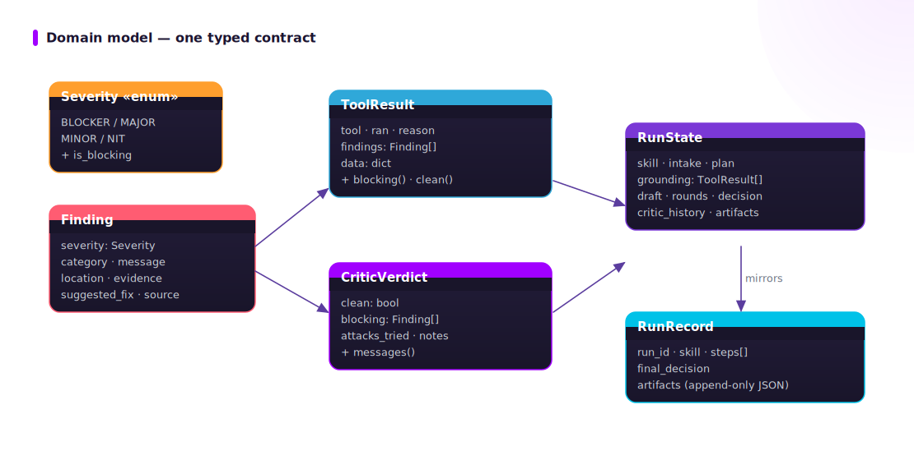

# 03 · Data flow — one typed contract end to end

Nothing in ADRA passes ad-hoc dicts between stages. Every artifact that crosses a boundary is a
dataclass from `adra/state.py`, and every one is JSON-serializable so a full run can be replayed
and audited.

Read order: 02 → **03** → 04. Landing: [architecture.md](./architecture.md).

## The typed domain model



## What crosses each boundary


| Boundary | Object | Carries |
|---|---|---|
| tool → skill / critic / provenance | `ToolResult` | `tool`, `ran`, `findings: list[Finding]`, `data` (raw evidence), `reason` (why it didn't run). |
| any check → verdict | `Finding` | `severity`, `category`, `message`, `location`, `evidence`, `suggested_fix`, `source`. |
| critic → orchestrator | `CriticVerdict` | `clean`, `blocking: list[Finding]`, `attacks_tried`, `notes`. |
| orchestrator (mutable run state) | `RunState` | `skill`, `intake`, `plan`, `grounding: dict[str, ToolResult]`, `draft`, `findings`, `critic_history`, `rounds`, `decision`, `artifacts`. |
| orchestrator → disk | `RunRecord` | append-only `steps` (one event per node) + `final_decision` + `artifacts` → `runs/<id>.json`. |

The full shapes are documented in [data-contract/03_run-record.md](../data-contract/03_run-record.md).

## Grounding *is* evidence (the second-method proof)

The single most important property of the data flow: a deterministic tool's output is used
**twice**, simultaneously.

1. **As grounding** — passed into the `generate` and `critic` prompts as facts the model may not
   contradict.
2. **As evidence** — persisted into the `RunRecord` so the verdict is backed by a reproducible
   "second-method proof", not the model's prose.

This is why a `Finding` always carries an `evidence` string (e.g. `behind=12`,
`patterns=['\\bclaude\\b']`, `Ran 0 tests`). The verdict is never "the model said so"; it is
"the tool measured X, here is X".

## Severity ordering and the blocking rule

`Severity` is an ordered enum: `BLOCKER > MAJOR > MINOR > NIT`. The blocking predicate is shared:

```python
class Severity(str, Enum):
    @property
    def is_blocking(self) -> bool:
        return self in (Severity.BLOCKER, Severity.MAJOR)
```

`ToolResult.blocking` and `.clean` derive from it, and the critic's `clean` flag is simply "no
blocking `Finding` survived". Blocking findings are **deduped by `(category, message)`** before
the verdict, so the deterministic and LLM passes can't double-count the same issue.

## How the offline mock stays honest

With the `mock` provider, `generate`/`critic`/`judge` return **node-keyed canned text**
(`adra/llm.py`, `_CANNED`). That text is deliberately thin — it never invents findings. The
**real substance** comes from the deterministic tools: each skill merges the canned summary with
`state.grounding_findings()`. So the offline demo's verdicts (a stale-base PR blocked, a
language/leak diff blocked, a clean experiment accepted) are produced by the **deterministic
floor**, not by a model pretending to reason. That is what makes "runs offline with no key" an
honest claim rather than a degraded mode.

## What this page IS and is NOT

- **IS** the contract every stage speaks; read it before extending a tool or skill.
- **IS NOT** the *intake* contract (what a caller must supply) — that is
  [data-contract/01_intake-contracts.md](../data-contract/01_intake-contracts.md).

## See also

- [data-contract/data-contract.md](../data-contract/data-contract.md) — full field-level schemas.
- [04_run-sequence.md](./04_run-sequence.md) — the contract in motion for one `pr_eval`.
- [methodologies/04_deterministic-first.md](../methodologies/04_deterministic-first.md) — why
  evidence carries the verdict.
