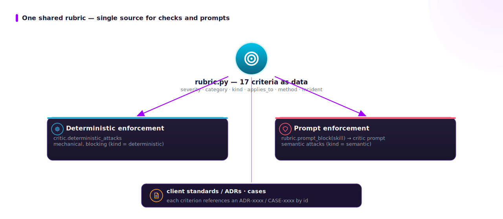
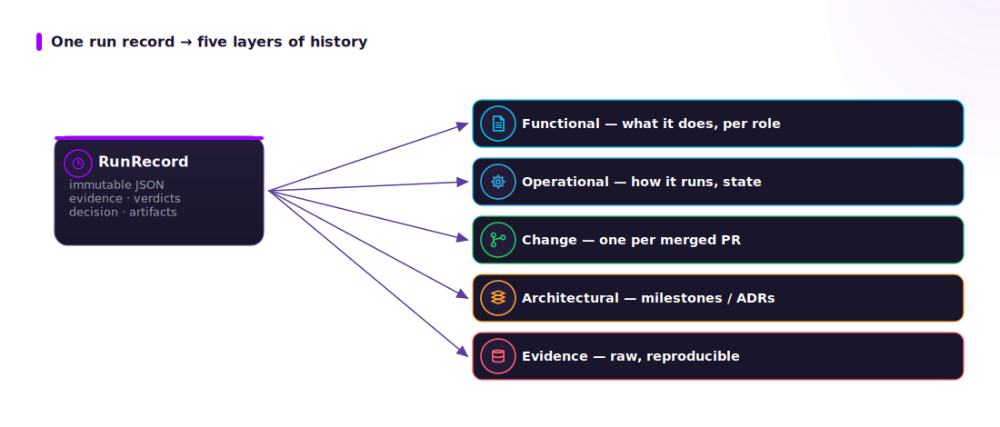

# Governance: rubric, standards, provenance

## The shared adversarial rubric

`adra/rubric.py` is the single source of the adversarial criteria. Each `RubricItem`
is data — `severity`, `category`, `kind` (`deterministic` | `semantic`),
`applies_to` (skills), `method` (the operational check), and the originating
`incident` (an anonymized client case). It is consumed in two places so code and
prompt cannot drift:



Examples (id → where it bites): `stale_merge_base`, `destructive_deletions`,
`dropped_bundle_resource`, `bundle_validate`, `exact_ci_repro`, `zero_tests_no_data`,
`test_discoverability`, `unverified_claim`, `unverifiable_no_access`,
`conclusion_beyond_evidence`, `convention_conformance`, `contract_drift`,
`swallowed_error`, `minimum_functional`, `blast_radius`, `language_leak`,
`overclaim_language`.

## The client standards suite

The active client governance suite is the baseline the agent grounds on. ADRA ships a
**fictional, fully anonymized** client — **Northwind Trading / Northwind Data Platform
(NDP)** — so the suite is complete and shareable without referencing any real
organization:

```
adra/clients/synthetic/northwind/   (the active client dir; ADRA_CLIENT_DIR overrides)
├── README.md            client profile + index
├── conventions.md       language / naming / branching / PR / labels
├── ci-standards.md      the exact CI command, coverage, bundle validate
├── glossary.md
├── adr/ADR-0001..0008   architecture decision records
└── cases/CASE-2024-0xx  anonymized post-incident notes the rubric is learned from
```

`adra/utils.load_standard("adr/ADR-0002-...")` loads them from the active client dir; the
rubric references them by id; the prompts cite them. **Retarget a client by setting
`ADRA_CLIENT_DIR`** (or `Settings.client_dir`) and updating the rubric incident
references — no code change.

## Provenance and the change-history chain

Every run writes an immutable `RunRecord` (`provenance.py`): `run_id`, skill, each
step (inputs · tool evidence · critic verdicts), the decision, and the artifacts.
The `document` skill renders that record into the human history layers, so technical,
operational and functional history all trace back to one auditable artifact.



This mirrors internal-algorithmic-auditing and model-card practice (see
[../refs/README.md](../refs/README.md) §6): documentation generated from evidence,
not memory.

## What stays human

High-consequence actions are never autonomous: creating/merging PRs, pushing,
running the engine, and any decision-support risk claim. The agent prepares evidence
and a recommendation; a person decides (ADR-0007, NIST AI RMF — *manage/govern*).
