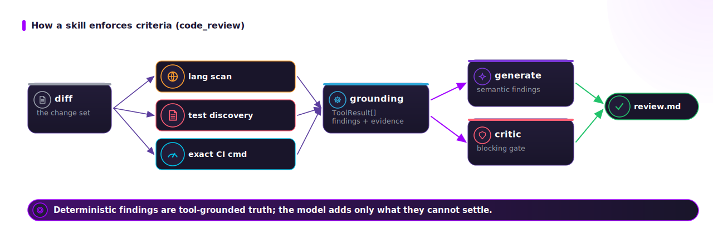

# Use cases — the six skills

One deep page per capability. Each follows the same template: **input → grounding (deterministic)
→ generate → output artifact → the rubric items it enforces**. All six are the **same loop**,
differing only by prompt (`adra/prompts/<skill>.md`) and grounding tools.

## Read in order

| # | Skill | Input | Output | Page |
|---|---|---|---|---|
| 01 | `code_review` | a diff / patch | `review.md` | [01_code-review.md](./01_code-review.md) |
| 02 | `pr_eval` | a PR / branch | `pr_verdict.md` + `pr_body.md` | [02_pr-eval.md](./02_pr-eval.md) |
| 03 | `experiment` | a hypothesis + probes | experiment page + `__v0X-synthesis` | [03_experiment.md](./03_experiment.md) |
| 04 | `improve` | a component / context | `proposal.md` | [04_improve.md](./04_improve.md) |
| 05 | `document` | a run record / context | PR / experiment / methodology page | [05_document.md](./05_document.md) |
| 06 | `decide` | a problem + routes | `route_analysis.md` (**human-owned**) | [06_decide.md](./06_decide.md) |

## How a skill enforces criteria

Each skill's `generate` is **advisory** (the prompt asks the model to behave); the **critic
enforces**. Deterministic blockers are non-negotiable — e.g. `pr_eval` forces `changes-requested`
whenever any grounding tool reports a blocker, regardless of the model's verdict. The rubric items
each skill is subject to come from `rubric.for_skill(skill)` (cross-cutting items always included).

## The five steps every skill owns

`plan → ground → generate → revise → finalize` (`adra/skills/base.py`). Only `ground` is LLM-free.
The orchestrator threads the loop and writes the run record (see
[../architecture/01_overview.md](../architecture/01_overview.md)).

## What this section IS and is NOT

- **IS** a true input→output spec for each skill, naming the exact tools and rubric items.
- **IS NOT** a list of features the engine might gain. Every skill here is registered in
  `adra/skills/__init__.py` and exercised by the offline demo and the test suite.

## See also

- [../methodologies/methodologies.md](../methodologies/methodologies.md) — the methods applied here.
- [../data-contract/01_intake-contracts.md](../data-contract/01_intake-contracts.md) — the exact
  intake each skill expects.
- [../guides/02_the-cli.md](../guides/02_the-cli.md) — how to invoke each one.
